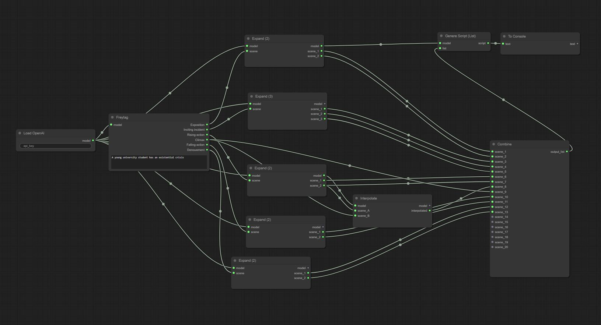

# Kinotron


### A powerful toolkit for generating complex film screenplays with the help of ComfyUI nodes and LLMs.

**Kinotron** is a modular, open-source project that empowers users to generate and develop film screenplays with the assistance of large language models (LLMs). Built on top of ComfyUI, Kinotron provides an interactive and creative interface for writers, filmmakers, and storytellers, allowing them to harness the power of AI to craft intricate narratives, characters, dialogues, and scene structures.

Whether you're an aspiring screenwriter or a seasoned director looking to explore new creative possibilities, Kinotron offers an intuitive environment to experiment with storytelling in a whole new way.

---

## 🎬 Features

- **Modular Workflow:** Kinotron breaks down the screenplay creation process into manageable nodes, allowing users to focus on specific elements such as dialogue generation, plot progression, or scene description.
- **LLM-Powered Creativity:** Leverage the strength of large language models (LLMs) to generate and refine ideas, ensuring your screenplay evolves with coherent narrative flow and vivid descriptions.
- **Dynamic Interactivity:** The ComfyUI interface offers real-time feedback and customization, letting you fine-tune each aspect of the screenplay generation process.
- **Flexible Nodes:** Each node represents a specific step in the screenplay development, from character introduction to scene transitions. You can rearrange or modify nodes to experiment with different storytelling techniques.
- **Collaborative Development:** Kinotron is designed for both individual users and collaborative teams, with the ability to share workflows and screenplay drafts between users.

---

## 🚀 Getting Started

Follow the steps below to install Kinotron and start generating your own screenplays.

### Prerequisites

Before you begin, make sure you have the following installed:

- [Python 3.7+](https://www.python.org/downloads/)
- [ComfyUI](https://github.com/comfyanonymous/ComfyUI)
- [OpenAI's GPT API key](https://beta.openai.com/signup/)

### Installation

1. **Clone the repository**:
   ```bash
   git clone https://github.com/yourusername/kinotron.git'''
